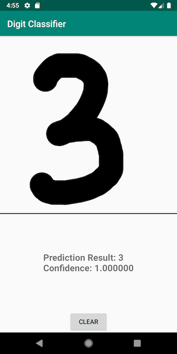

# Digit Classifier
This repository contains an end-to-end sample of a digit classifier model built with TensorFlow 2.0 (Keras API), and trained on MNIST dataset.

* Python Notebook showing how to train the model and convert to TensorFlow Lite format.  
* An [Android app](android/) that uses the TensorFlow Lite model to classify your handwritten digits.

